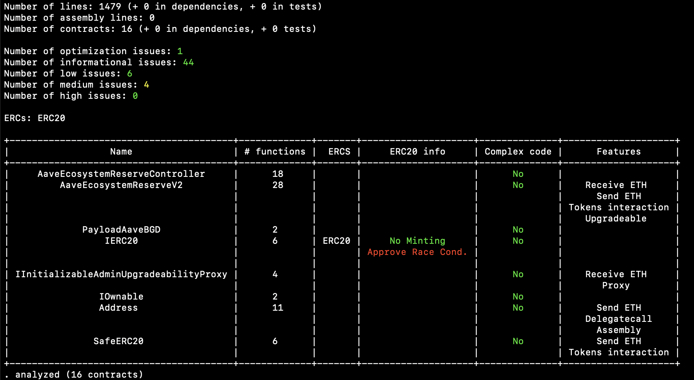
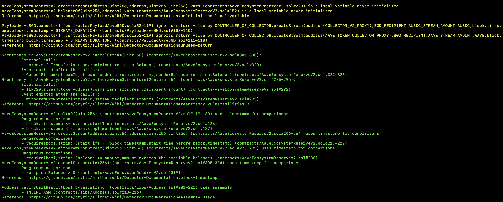
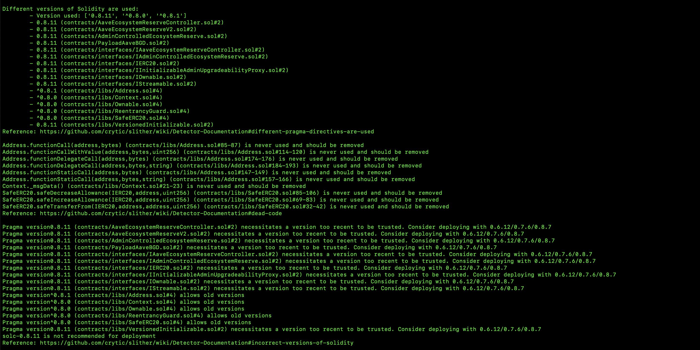
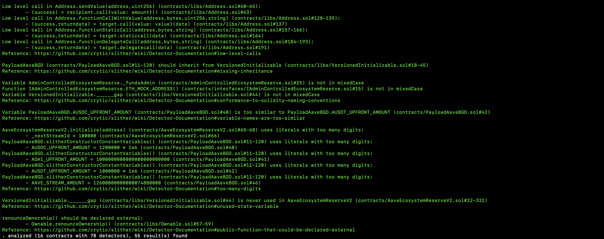
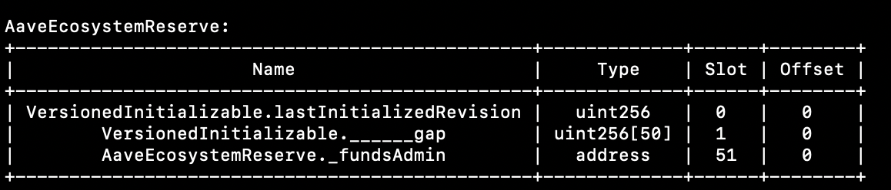
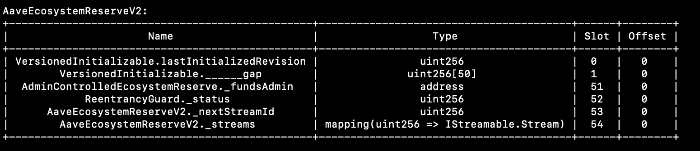

# Slither report

 

## Summary

 
 
 

## Detectors

 
 
 

## Storage layout diff between reserves' versions

 

*AaveEcosystemReserveV1, on [https://etherscan.io/address/0xa335e2443b59d11337e9005c9af5bc31f8000714#code](https://etherscan.io/address/0xa335e2443b59d11337e9005c9af5bc31f8000714#code)*

 

*AaveEcosystemReserveV2*

 
 
 